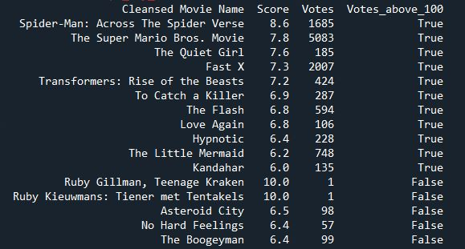

# Movie Data Extraction and Rating 

This script extracts data from Pathe and retrieves movie ratings from The Movie Database (TMDb). 
Its primary purpose is to provide the user with a list of movies currently screening in the theater,  
along with their respective scores from TMDb. 

## Example output

  S

## Dependencies

The script requires the following Python libraries:

- `requests`
- `beautifulsoup4`
- `json`
- `pandas`
- `re`
- `api_key_doc`

## How It Works

The script follows these steps:

1. Fetch the HTML content of a given URL using the `requests` library. In this example, 
the URL is for Pathé Cinema in Eindhoven.

2. Parse the HTML to find a script tag containing a JSON. This JSON includes data about 
the movies currently playing at the theater. The data is extracted using `BeautifulSoup` 
and `json`.

3. Extract movie names from the JSON and convert them into a pandas DataFrame. This is 
achieved in the `extract_movie_names` function.

4. Clean up movie names by removing any non-movie related information and duplicates in 
the `clean_movie_names` function.

5. Retrieve movie scores from The Movie Database (TMDb) using their API, which is 
performed by the `get_tmdb_score` function.

6. Add these scores as a new column to the existing DataFrame.

7. Sort the DataFrame based on the movie scores in descending order and print it.

## Usage and Results

For the script to work, it needs an API key from TMDb. The API key is expected to be 
stored in a module named `api_key_doc`, in a variable called `api_key`.

After setting up the API key, you can run the script directly. It will print a DataFrame 
with all the movies currently playing at Pathé Cinema in Eindhoven and their respective 
scores from TMDb.

**Note:** Please ensure that you have the necessary permissions to web scrape the data 
from the desired URL and use the TMDb API, as certain websites and APIs may have 
restrictions on their use. 

